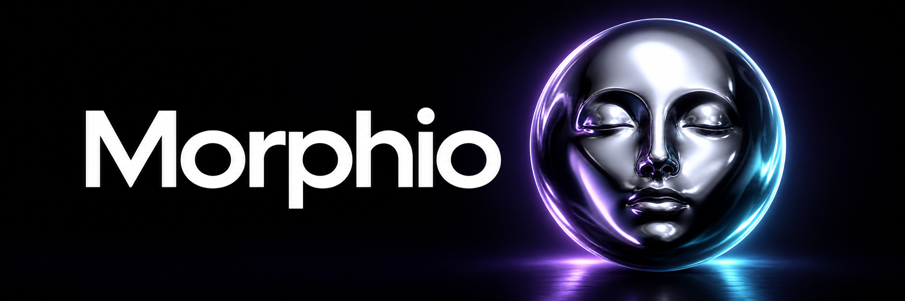
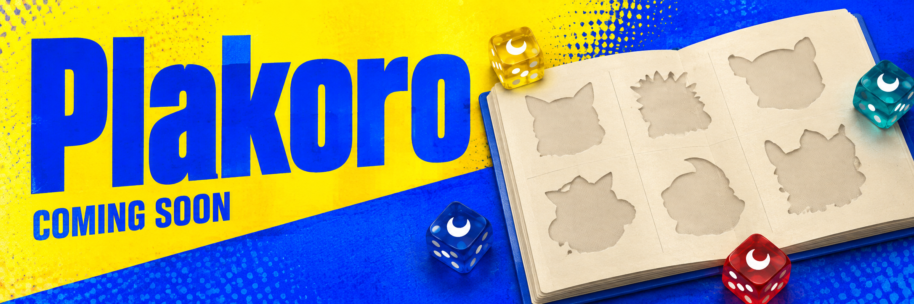
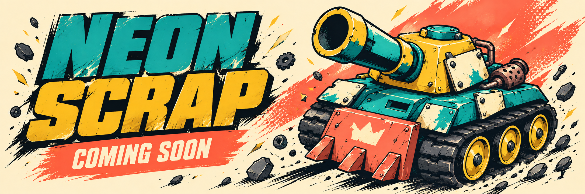

# Hi, I'm Tomás Ruiz-López 👋

I'm a Principal Software Engineer working across iOS, Swift, and AI. These are some of the open-source projects I've built and contributed to, followed by apps I've developed.

## Bow

[Bow](https://github.com/bow-swift/bow) is a cross-platform library for typed functional programming in Swift, providing higher-kinded type emulation, type classes, data types, optics, effects, and more.

[Repository](https://github.com/bow-swift/bow) · [Website and documentation](https://bow-swift.io/)

## Bow Arch

[Bow Arch](https://github.com/bow-swift/bow-arch) explores pure functional application architecture in Swift. Built around comonadic user interfaces, it emphasizes immutable state, composable components, clear separation of concerns, and testability.

[Repository](https://github.com/bow-swift/bow-arch) · [Website and documentation](https://arch.bow-swift.io/)

## AlphaSantorini

[AlphaSantorini](https://github.com/truizlop/AlphaSantorini) is an AlphaZero-style system for the board game Santorini: a Swift game engine, Monte Carlo tree search, MLX model training, and a browser UI powered by SwiftWasm and ONNX Runtime Web.

[Repository](https://github.com/truizlop/AlphaSantorini)

## DQNSnake

[DQNSnake](https://github.com/truizlop/DQNSnake) is a hybrid Swift and Python reinforcement-learning project that trains a Deep Q-Network to play Snake. Swift owns the DQN, training, evaluation, and checkpointing pipeline, with MLX providing the neural-network stack.

[Repository](https://github.com/truizlop/DQNSnake)

## LovecraGPT

[LovecraGPT](https://github.com/truizlop/LovecraGPT) is an educational, GPT-like language model built in Swift with MLX and trained on a small corpus of H. P. Lovecraft's writing. It covers corpus preparation, byte-level BPE tokenization, training, ONNX export, and browser inference.

[Repository](https://github.com/truizlop/LovecraGPT) · [Try the browser demo](https://truizlop.github.io/LovecraGPT/)

## ndrstnd

[ndrstnd](https://github.com/truizlop/ndrstnd) turns large, agent-produced branch changes into a local, evidence-linked review workspace with a narrative story, timeline, test plan, and full diff.

[Repository](https://github.com/truizlop/ndrstnd) · [Website](https://truizlop.github.io/ndrstnd/)

## nef

[nef](https://github.com/bow-swift/nef) is a toolset for creating verified documentation with Xcode Playgrounds. It can compile playgrounds and export them as Markdown, Jekyll-ready sites, or Carbon code snippets.

[Repository](https://github.com/bow-swift/nef) · [Website and documentation](https://nef.bow-swift.io/)

## nef-editor-client

[nef-editor-client](https://github.com/bow-swift/nef-editor-client) is the open-source iPad client for nef Playgrounds. It finds Swift packages through GitHub and works with the nef backend to generate playgrounds that can be opened and used directly on iPad.

[Repository](https://github.com/bow-swift/nef-editor-client) · [App Store](https://apps.apple.com/app/nef-playgrounds/id1511012848)

## Bow OpenAPI

[Bow OpenAPI](https://github.com/bow-swift/bow-openapi) is a command-line tool that generates Swift network clients and Swift packages from OpenAPI or Swagger specifications, with support for Xcode integration and testable effects through Bow.

[Repository](https://github.com/bow-swift/bow-openapi) · [Website and documentation](https://openapi.bow-swift.io/)

## Stormfather

[Stormfather](https://github.com/truizlop/stormfather) is an original, unofficial fan-made living 3D atlas of Roshar, built with React, Three.js, and Blender. It combines an explorable continent with detailed landmarks, animated inhabitants, caravans, ships, and a Highstorm that travels across the world.

[Repository](https://github.com/truizlop/stormfather) · [Explore the atlas](https://truizlop.github.io/stormfather/)

## Apps

### Relax

Relax is a self-care app for guided breathing, mood journaling, and daily affirmations. It offers a quiet space to pause, reflect on your day, and build a more mindful routine.

[App Store](https://apps.apple.com/app/id6499126346)

### Morphio

Morphio turns a sequence of portraits into smooth face-morphing animations. Choose two to eight photos, set the rhythm, and share the transformation as a video or GIF from your iPhone or iPad.

[Landing page](https://truizlop.github.io/morphio-landing/) · [App Store](https://apps.apple.com/app/id6762181669)

### Stay Afloat

Stay Afloat is a real-time pipe-routing game inside a busy cruise ship. Rotate junctions, guide wastewater to treatment, and catch leaks while tiny passengers carry on with their holiday.

[Landing page](https://truizlop.github.io/StayAfloatWebsite/) · [App Store](https://apps.apple.com/app/id6810699722)

### Gut Rush

Gut Rush is a playful 3D runner through the digestive system. Guide a tiny bite through eight organ-inspired worlds, dodge obstacles, and discover how digestion works through fast-paced swipe gameplay.

[Landing page](https://truizlop.github.io/gut-rush-website/) · [App Store](https://apps.apple.com/app/id6809466442)

### Daily City Planner

Daily City Planner is a daily deduction puzzle on a city blueprint. Place streets, parks, lakes, and buildings to satisfy every clue, with one uniquely solvable city to uncover each day.

[Landing page](https://truizlop.github.io/daily-city-planner-site/) · [App Store](https://apps.apple.com/app/id6789138152)

### Plakoro · Coming soon

Plakoro is a companion for collectors of the Pokémon Plakoro series. Browse sets, track owned dice and individual variants, follow your collection's completion, and explore character and move cards in English, Spanish, and Japanese.

**Coming soon.**

### Neon Scrap · Coming soon

Neon Scrap is a local two-player tank duel on one shared iPhone. Pick your ride, face off across the screen, and battle with transforming weapons, wraparound arenas, and a bold comic-book style.

**Coming soon.**
